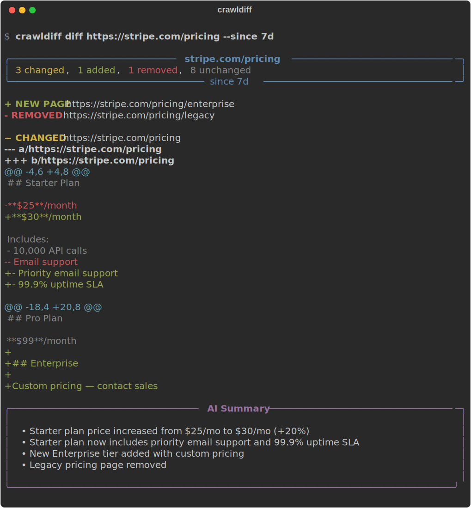

<p align="center">
  <h1 align="center">crawldiff</h1>
  <p align="center">
    <strong><code>git log</code> for any website.</strong>
  </p>
  <p align="center">
    Track what changed on any website. Git-style diffs with optional AI summaries.<br/>
    Powered by Cloudflare's <a href="https://developers.cloudflare.com/browser-rendering/rest-api/crawl-endpoint/">/crawl</a> endpoint.
  </p>
  <p align="center">
    <a href="https://github.com/GeoRouv/crawldiff/actions/workflows/ci.yml"></a>
    <a href="https://pypi.org/project/crawldiff/"></a>
    <a href="https://github.com/GeoRouv/crawldiff/blob/main/LICENSE"></a>
    <a href="https://python.org"></a>
  </p>
</p>

---

<p align="center">
  
</p>

```bash
pip install crawldiff
```

```bash
# Snapshot a site
crawldiff crawl https://stripe.com/pricing

# Come back later. See what changed.
crawldiff diff https://stripe.com/pricing --since 7d
```

## What is this

A CLI tool for tracking website changes over time. It crawls pages via Cloudflare's [`/crawl` endpoint](https://developers.cloudflare.com/browser-rendering/rest-api/crawl-endpoint/), stores markdown snapshots locally in SQLite, and produces unified diffs between crawls. Optionally summarizes changes with AI.

No SaaS subscriptions. No proprietary dashboards. Just `crawldiff diff`.

## Setup (30 seconds)

You need a free [Cloudflare account](https://dash.cloudflare.com/sign-up). That's it.

```bash
# Install
pip install crawldiff

# Set your Cloudflare credentials (free tier: 5 jobs/day, 100 pages/job)
export CLOUDFLARE_ACCOUNT_ID="your-account-id"
export CLOUDFLARE_API_TOKEN="your-api-token"

# Or save to config (env vars take precedence over config file)
crawldiff config set cloudflare.account_id your-id
crawldiff config set cloudflare.api_token your-token
```

## Usage

### Track changes on any website

```bash
# Take a snapshot
crawldiff crawl https://competitor.com

# Later, see what changed
crawldiff diff https://competitor.com --since 7d

# Output as JSON (pipe to jq, Slack, wherever)
crawldiff diff https://competitor.com --since 7d --format json

# Save a markdown report
crawldiff diff https://competitor.com --since 30d --output report.md
```

### Watch a site continuously

```bash
# Check every hour, get notified when something changes
crawldiff watch https://stripe.com/pricing --every 1h

# Check every 6 hours, skip AI summary
crawldiff watch https://competitor.com --every 6h --no-summary
```

### View history

```bash
crawldiff history https://stripe.com/pricing
```

```
       Crawl History — https://stripe.com/pricing
┏━━━━━━━━━━━━━━━━┳━━━━━━━━━━━━━━━━━━━━━┳━━━━━━━┓
┃ Job ID         ┃ Date                ┃ Pages ┃
┡━━━━━━━━━━━━━━━━╇━━━━━━━━━━━━━━━━━━━━━╇━━━━━━━┩
│ cf-job-abc-123 │ 2026-03-13 09:00:00 │    12 │
│ cf-job-def-456 │ 2026-03-06 09:00:00 │    11 │
│ cf-job-ghi-789 │ 2026-02-27 09:00:00 │    11 │
└────────────────┴─────────────────────┴───────┘
```

### More options

```bash
# Deeper crawl
crawldiff crawl https://docs.react.dev --depth 3 --max-pages 100

# Static sites (faster, no browser rendering)
crawldiff crawl https://blog.example.com --no-render

# Ignore whitespace noise in diffs
crawldiff diff https://example.com --since 7d --ignore-whitespace
```

## AI Summaries (optional)

crawldiff can optionally summarize diffs using an LLM. Three providers are supported:

```bash
# Cloudflare Workers AI (free, uses your existing CF account)
crawldiff config set ai.provider cloudflare

# Anthropic Claude
pip install crawldiff[ai]
crawldiff config set ai.provider anthropic
export ANTHROPIC_API_KEY="sk-..."

# OpenAI
pip install crawldiff[ai]
crawldiff config set ai.provider openai
export OPENAI_API_KEY="sk-..."
```

Don't want AI? Just use `--no-summary`. Diffs work fine without it.

## How it works

```
1. crawldiff crawl <url>
   └─→ Cloudflare /crawl API (headless browser, respects robots.txt)
   └─→ Store Markdown snapshots in local SQLite (~/.crawldiff/)

2. crawldiff diff <url> --since 7d
   └─→ Cloudflare /crawl with modifiedSince (only fetches changed pages)
   └─→ Diff against stored snapshot (unified diff via difflib)
   └─→ AI summary (optional)
   └─→ Syntax-highlighted diffs in the terminal (via rich)
```

Cloudflare's `modifiedSince` parameter means repeat diffs only fetch changed pages, not the entire site.

## Comparison

| | crawldiff | Visualping | changedetection.io | Firecrawl |
|---|---|---|---|---|
| Open source | Yes | No | Yes | Yes |
| CLI-native | Yes | No | API | API |
| AI summaries | Built-in | No | Via plugins | Built-in |
| Incremental crawling | Yes (`modifiedSince`) | No | No | No |
| Local-first storage | SQLite | Cloud | Self-host or cloud | Cloud |
| JSON/pipe output | Yes | No | Yes | Yes |
| Free tier | 5 jobs/day, 100 pages | Limited | Yes (self-host) | 500 credits |

## All commands

```
crawldiff crawl <url>      Snapshot a website
crawldiff diff <url>       Show what changed (the main command)
crawldiff watch <url>      Monitor continuously
crawldiff history <url>    View past snapshots
crawldiff config set|get|show   Manage settings
```

## Contributing

Contributions welcome! See [CONTRIBUTING.md](CONTRIBUTING.md) for setup and guidelines.

## License

MIT
